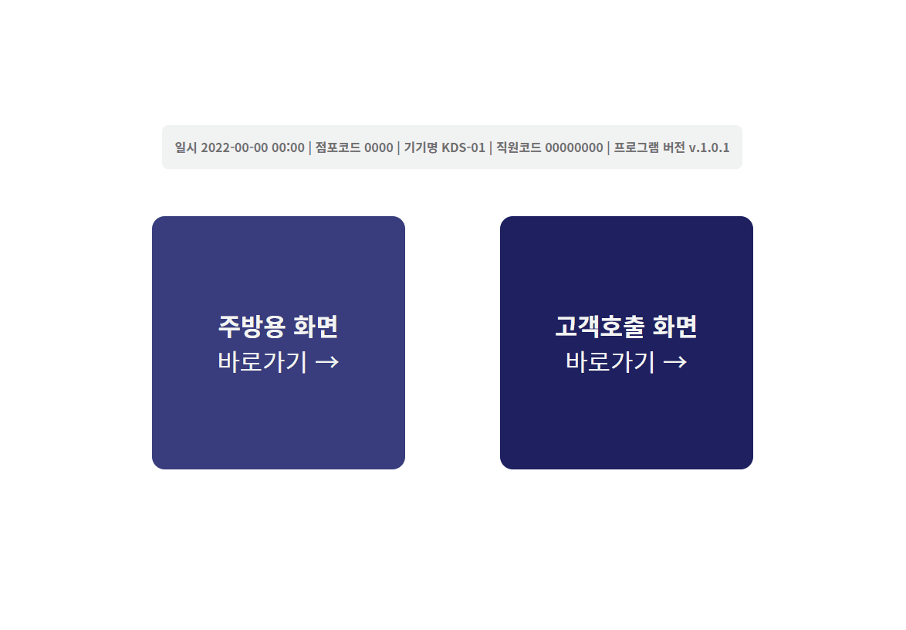
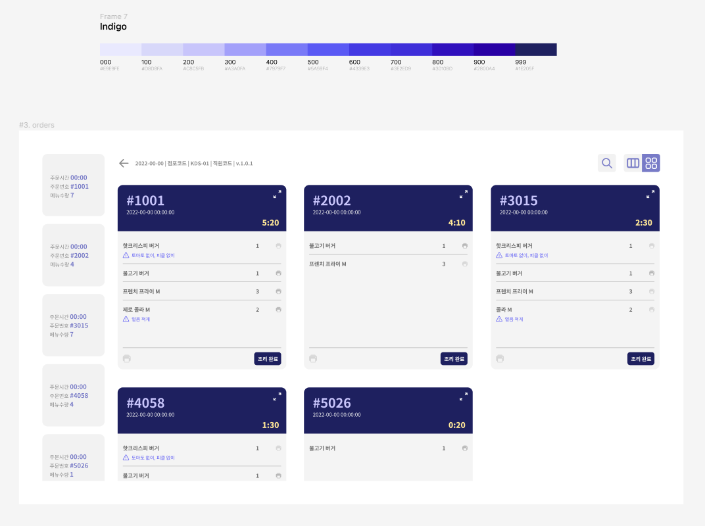
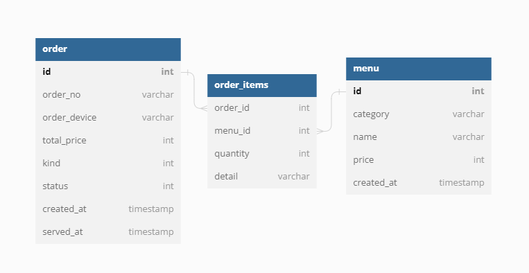

# 2022 KDS PJT


## Description

점포의 POS, KIOSK와 연동하여 주문/조리 내역 조회 및 픽업 알림을 위한

KDS(Kitchen Display Systems) 리액트 웹앱입니다.




### 기획/설계
- [화면 설계 (Figma)](https://www.figma.com/file/jusYaheQOrpoxGM4sKSl6p/KDS?node-id=3%3A24)


- [DB 설계 (dbdiagram)](https://dbdiagram.io/d/625e196b2514c97903507a74)



### Goals

+ 화면 설계를 기반으로 화면을 만들 수 있다
+ 재사용성을 위해, 최대한 작은 컴포넌트 단위로 분리할 수 있다
+ 라우팅을 통해 SPA를 구현할 수 있다
+ <s>미디어쿼리를 통해 반응형 웹을 만들 수 있다</s>


## Quick Start
+ install
```
git clone https://github.com/callu9/wait-ring
npm install
```
+ build
```
npm run build
```
+ run
```
npm start
```


## TODO

+ KDS 객화면 제작
+ KIOSK 개발 및 연동
+ CRUD 위한 Firebase 적용
    + [ref. 유튜브 영상 (Firebase로 당근마켓 만들기)](https://www.youtube.com/watch?v=9RkXchEJgKU&list=PLfLgtT94nNq3PzZinqs9Afuiai--r5NB_&index=1&t=8s)
    + [ref. 블로그 (React X Firebase)](https://hong-jh.tistory.com/entry/%ED%8C%8C%EC%9D%B4%EC%96%B4%EB%B2%A0%EC%9D%B4%EC%8A%A4-X-%EB%A6%AC%EC%95%A1%ED%8A%B8-CRUD%EA%B5%AC%ED%98%841?category=1179153)

